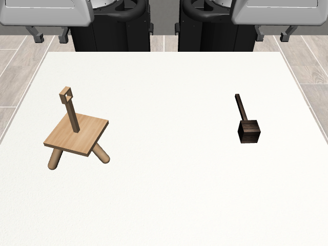
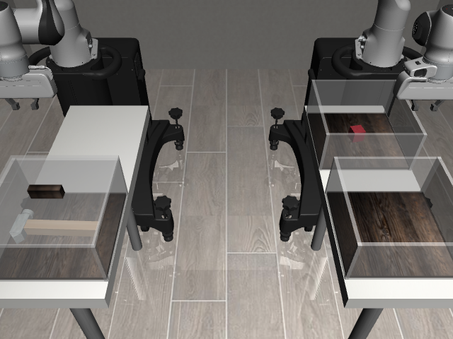
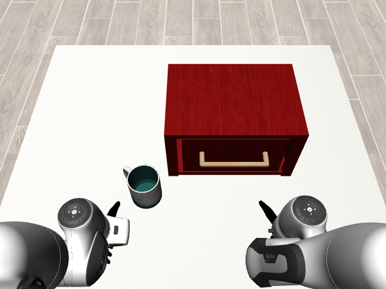
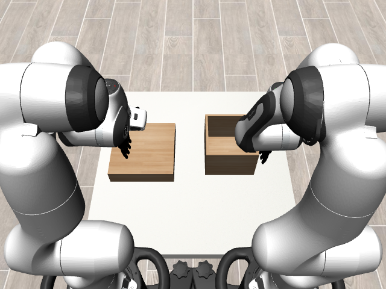
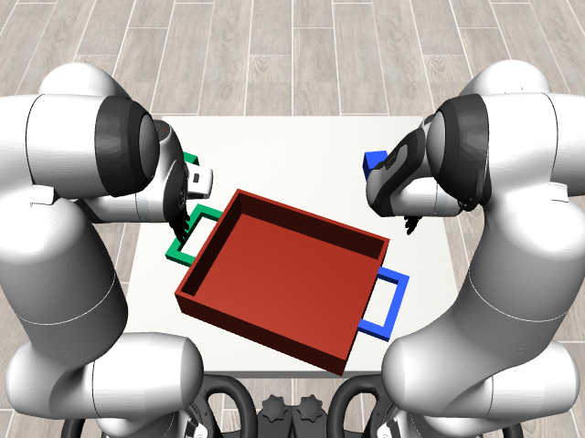
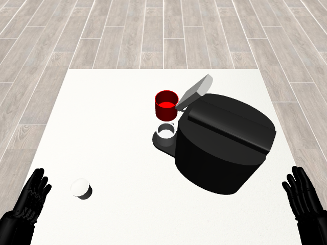
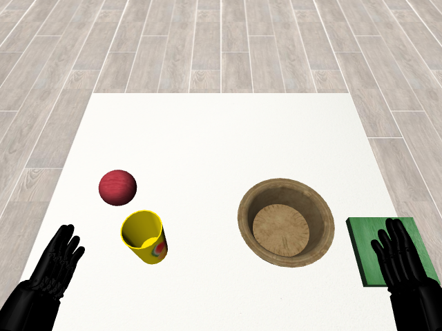
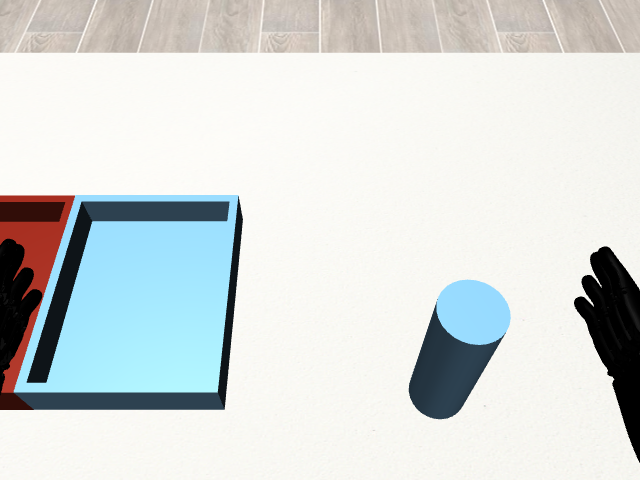

# Avaibale Environments

We provide the following environments with suggested embodiments:

* TwoArmThreading (Two Panda arms with parallel grippers)

* TwoArmThreePieceAssembly  (Two Panda arms with parallel grippers)

* TwoArmTransport (Two Panda arms with parallel grippers)

* TwoArmDrawerCleanup (Two Panda arms with dexterous hands)

* TwoArmBoxCleanup (Two Panda arms with dexterous hands)

* TwoArmLiftTray (Two Panda arms with dexterous hands)

* TwoArmCoffee (Humanoid robot with dexterous hands)

* TwoArmPouring (Humanoid robot with dexterous hands)

* TwoArmCanSortRandom (Humanoid robot with dexterous hands)
